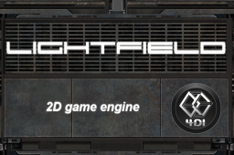

Lightfield 1 engine
===================
Lightfield 2D game engine written in C++03 (6k lines), supports Samsung Bada OS/Wave I-II devices and more with OpenGL ES 1.1 GPU. 

The architecture of engine
==========================
<ul>
<li>Audio: supports Bada player</li>
<li>Core: collections, string, timer etc.</li>
<li>Engine: scene graph management, EGL support</li>
<li>Graphics: vertex, texture, sprite management on OpenGL ES 1.1 API level</li>
<li>GUI: button, slider etc. control support top on the graphics subsystem</li>
<li>Input: Bada touch, and hardware buttons manager</li>
<li>IO: logger and read/write support for cross-platform object serialization</li>
<li>Math: vector, matrix, rectangle and more for 2D games</li>
<li>Test: simple, but platform independent test system</li>
</ul>
