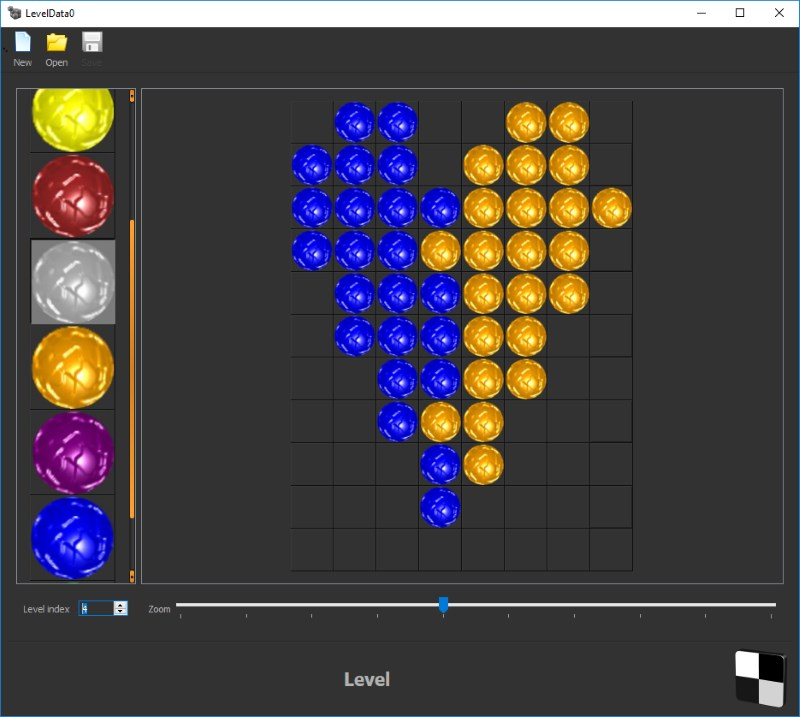

Lightfield 2 engine
===================

Lightfield is flexible and cross-platform 2D game engine written in C++. It enables a powerful high level Lua API for creating complete 2D applications such as logical games.

Using SDK
=========
Get and Run
-----------
1. Get the source code
2. Get depencies and copy on Lightfield2-master folder <a target="_blank" href="http://4dillusions.com/Download/LightfieldEngine2/Depencies/Lightfield2Depencies.zip"><b>precompiled depency pack</b></a>
3. Run Code\Solution\Win32\Release\Lightfield2.exe

Scripting
---------
Lightfield 2 is Lua based engine. You can configurate and write game logic with Lua for this engine.

1. Code\Solution\Win32\Debug\Config.lua - folder places for contents and scripts.
2. Code\Solution\Win32\Debug\Home\Script\Settings.lua - game settings 
3. Code\Solution\Win32\Debug\Home\Script\Main.lua - entry point of game logic

Lua bytecode
------------
You can use Lua text or binary files, the engine recognises automatically and load .lua (lua text) or .lby (lua binary) script files.
If you put .lua and .lby files altogether, engine loads .lua textfile.

LuaC.exe (LuaCompiler) is a .lua -> .lby translator. It's a console application, you can use it easily, for example: luac -o Config.lby Config.lua

Doxygen documentation
---------------------
Look at Tutorials/LuaAPI in Scripting section, Engine and Editor documentation.
	
Compile the SDK
===============
Depencies
---------

1. audiere 1.9.4 sound engine for windows (precompiled)
2. D3D9 direct3d render from DirectX SDK 2012 june (precompiled)
3. glfw 3.0.2 render window and input support for windows (precompiled)
4. lua 5.2.2 script engine
5. Soil 1.16 OpenGL image library
6. QT 5.3.2 community edition is a user interface framework for editor (you can download the <a target="_blank" href="http://qt-project.org/downloads">QT SDK</a>)

Compile on Win32
----------------
open SDK VS2013 solution: Code\Solution\Win32\LightfieldEngine2SDK.sln

compile 
1. Soil 
2. Lua 
3. LFCore 
4. LFEngine 
5. Lightfield2App 
6. LuaCompiler 
7. LFEditor (QT 5.3.2 or later required)

settings  
set working directory on Lightfield2App and LuaCompiler: Properties\Debugging\Working Directory\..\Debug

Compile on Tizen
----------------
Create projects in: Code\Solution\Tizen (look at settings: Doc\ProjectSettings.txt)

compile 
1. Soil 
2. Lua 
3. LFCore 
4. LFEngine 
5. Lightfield2 